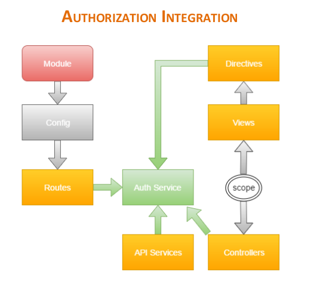

# angularjs-auth-token-management

For security reasons, APIs that make data changes on a system require a security token as part of the request. This security token may have some expiration policy which forces the client application to refresh it after certain period of time.  In this session, we take a look at how the security token can be managed on a Single Page Application with no page refresh.

This project has the following components:

<h2>Client:</h2>
AngularJS SPA which interacts with a NodeJS server to demo calls to secured APIS

<h2>Server:</h2>
NodeJS server with open and secured APIs. The API are secured with a JWT token

<h1>Branches</h1>
<h2>Master Branch: </h2>

Use this branch to take a look at how an application can consume and manage a security token(JWT) 

<h2>Auth Branch:</h2>
 Use this branch to look at the version of the code that contains the authorization changes.

 

 

 

 